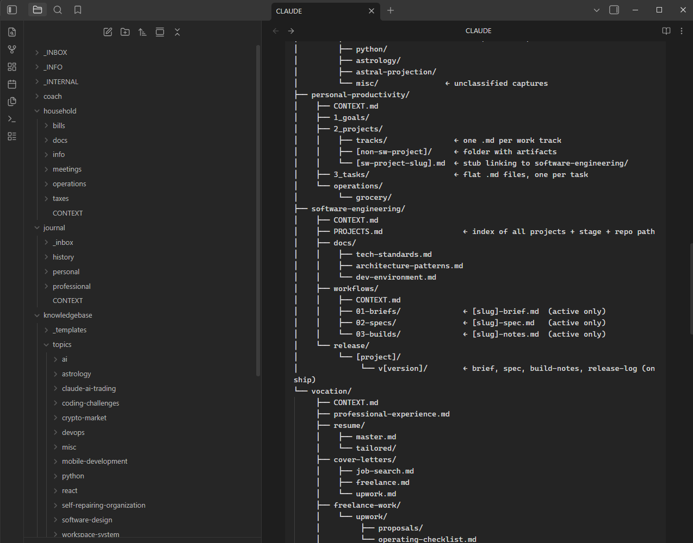

# obsidian-claude-workspace

**A file-based operating system for working with AI. Simple shared workspace agent.  no database, no framework, no agent runtime. Just folders, markdown, and routing.**

Most people use AI by opening a chat window and starting over every time. Context that took ten minutes to explain yesterday has to be re-explained today; you paste the same documents repeatedly; eventually the conversation gets too long and the model loses the thread. The usual "fix" is to reach for an agent framework and a vector database.

This is the opposite bet. **The folder is the app. The files are the UI. Plain markdown, written in English, is the whole system.** An AI agent drops into a folder, reads that folder's instructions, does its work, and exits — never loading more of your life than the task in front of it needs.

It's a template: clone it, open it as an Obsidian vault, point Claude Code at it, and tell the assistant to help you customize it.



---

## The core idea: three layers of context

The whole system is a discipline about *what the AI sees when*. Instead of one giant prompt, context is routed across three layers:

```
Layer 1 — CLAUDE.md         Always loaded.        The map.
Layer 2 — CONTEXT.md        Loaded per folder.    The room.
Layer 3 — Content files     Loaded on demand.     The work.
```

- **`CLAUDE.md`** is always in context, so it stays short and structural — the folder map, naming conventions, and a "what task → which folder" table. The floor plan on the wall.
- **`CONTEXT.md`** lives in each folder and is read only when the AI is working there. It can be detailed — stages, file naming, and per-request agent instructions ("when I say *plan my week*, do X") — without costing tokens on unrelated tasks.
- **Content files** (tasks, specs, notes, journal entries) load only when relevant. A conversation about a software project never loads your journal.

The insight isn't a bigger context window — it's **routing**. Give the model exactly the right thing, every time. Same AI, different room, different role: a technical co-builder in `software-engineering/`, a planning partner in `personal-productivity/`, a reflective listener in `journal/`.

---

## What you get out of the box

- **A routing map** (`CLAUDE.md`) and root onboarding (`CONTEXT.md`) that walk you — or the AI — through first-time setup.
- **A fully-worked example workspace:** `software-engineering/` is a complete pipeline — brief → spec → architecture → build → release — with staged folders, naming conventions, and matching skills. It's the reference for how a mature workflow looks.
- **`personal-productivity/`** — tasks, projects, and strategic "work tracks."
- **~30 skills** (`.claude/skills/`) — slash-command workflows spanning software (`/write-brief`, `/develop-requirements`, `/plan-architecture`, `/code-review`, `/log-release`), knowledge (`/distill-source`, `/study-topic`, `/quiz-me`), and career (`/analyze-job-posting`, `/tailor-resume`, `/write-cover-letter`).
- **A tutorial** (`TUTORIAL.md`) explaining *why* it's built this way — the three layers, frontmatter as a lightweight database, naming conventions as a findability index, and the "workspace as your app" reframe.

Frontmatter turns each plain-text file into a structured record the AI reads and writes directly (`status: open` → `status: done`), and — with Obsidian's Dataview plugin — into live dashboards. No database required; the file system *is* the database.

---

## Quick start

```bash
git clone https://github.com/bpilgrim/obsidian-claude-workspace.git my-workspace
cd my-workspace
claude            # point Claude Code at the folder
```

Then tell the assistant: *"I just set up this workspace. Help me customize it."* It reads `CONTEXT.md` and walks you through choosing your life areas, defining work tracks, and systematizing your recurring workflows. Open the same folder as an Obsidian vault for a nicer human view.

Full walkthrough in **[SETUP.md](SETUP.md)**; the reasoning behind the design in **[TUTORIAL.md](TUTORIAL.md)**.

---

## Why I built it

I needed a shared workspace to collaborate with an AI assistant. As I have been using AI it seems simpler UX is more powerful. Databases are complex and brittle. The simplest way to interact with a foundation model is over files and the filesystem. Obsidian front-matter adds the missing key to organize information, most importantly making it queryable.

*The three-layer, folder-based approach was inspired by ["Stop Building AI Agents. Use This Folder System Instead."](https://www.youtube.com/watch?v=MkN-ss2Nl10). This repo is a full, opinionated implementation of that idea — with a worked software-engineering pipeline, a skills library, and a documented setup path.*
